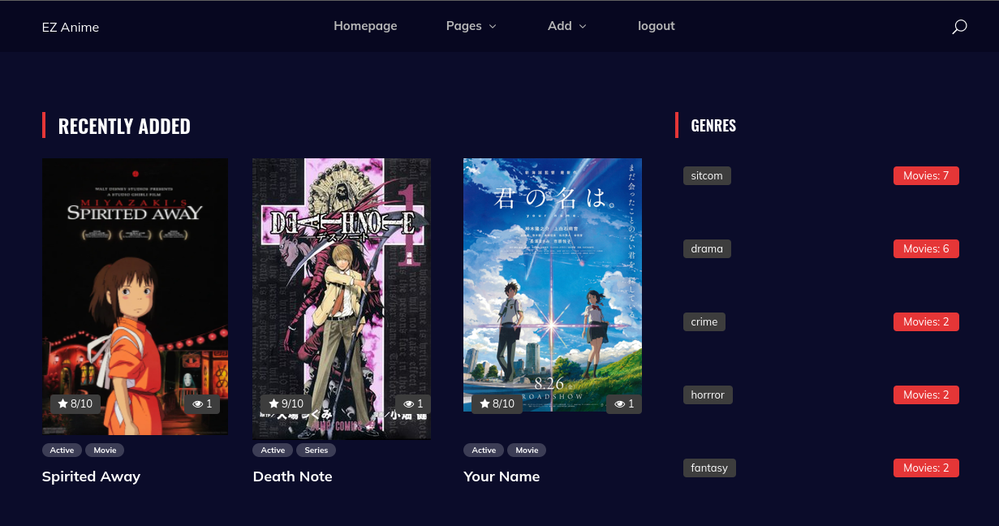
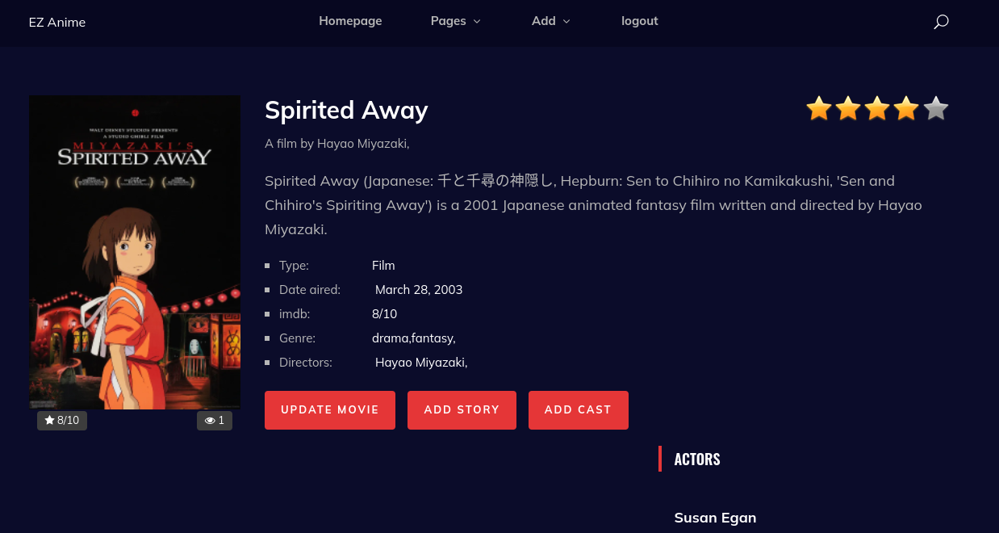

# Introduction
<p>Ez-anime is an authoritative source for anime using django framework.</p>
<p>In this project admins can register/login and then they can add items. Items are ReadOnly for unregistered users. <br>
This project contains 3 applications.</p>
<hr>
<ol>
    <li>Authentication</li>
    <li>Movie</li>
    <li>Element</li>
</ol>

<hr>
<h3>Authentication</h3>
<p>As its obvious from its name, this app is for Registering, logging in and logging out users.</p>

<hr>
<h3>Movie</h3>
<p>This app is for movie stuff. admins can add movie/series, add seasons, update and delete them.</p>

<hr>
<h3>Element</h3>
<p>This app is for movie elements such as actors, directors, genres.</p>


# How to use?

## Step 1

```commandline
$ git clone https://github.com/mohamad-liyaghi/ez-anime.git
```

## Step 2

```commandline
$ cd ez-anime
```

## Step 3

```commandline
$ docker-compose up --build
```

<hr>
<h1> Pics:</h1>



<a href="https://themewagon.com/themes/free-bootstrap-4-html5-gaming-anime-website-template-anime/">Template source</a>
